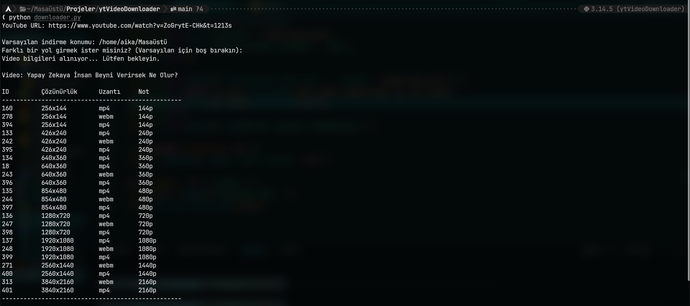
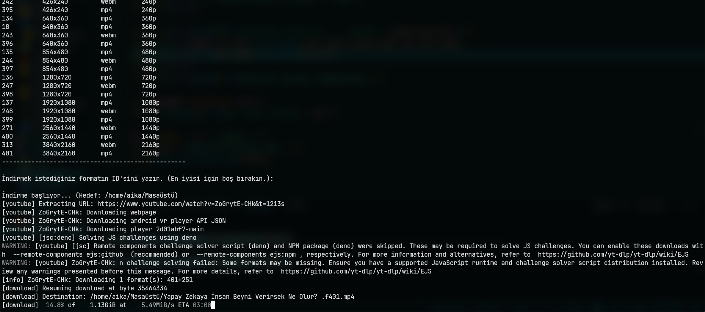

# Youtube Video Downloader

Python ve yt-dlp kütüphanesi kullanılarak geliştirilmiş, YouTube videolarını istenilen çözünürlükte indirmeye olanak tanıyan bir komut satırı aracıdır.



## Özellikler

* **Çözünürlük Seçimi:** Mevcut tüm formatları listeler ve kullanıcı seçimine sunar.
* **Varsayılan En İyi Kalite:** ID belirtilmediğinde otomatik olarak mevcut en yüksek video ve ses kalitesini birleştirir.
* **Dinamik Yol Seçimi:** Videoların nereye indirileceğini çalışma anında belirleyebilirsiniz (Varsayılan: Masaüstü).
* **Çerez Desteği:** YouTube kısıtlamalarını aşmak için Firefox çerezlerini kullanır.



## Gereksinimler

Yüksek çözünürlüklü (1080p ve üzeri) videoların görüntü ve ses parçalarını birleştirmek için sisteminizde **FFmpeg** yüklü olmalıdır.

### Linux (Arch Linux)
```bash
sudo pacman -S ffmpeg
```

### Windows
FFmpeg'i sisteme iki şekilde kurabilirsiniz:
1. **Winget ile (Önerilen):** Terminalinize `winget install ffmpeg` yazın.
2. **Manuel:** [ffmpeg.org](https://ffmpeg.org/download.html) üzerinden indirip `bin` klasörünü sistem PATH değişkenine ekleyin.

## Kurulum ve Kullanım

Sistem bütünlüğünü korumak için sanal ortam kullanılması tavsiye edilir.

### 1. Depoyu Klonlayın
```bash
git clone [https://github.com/kendineyazilimci/YoutubeVideoDownloader](https://github.com/kendineyazilimci/YoutubeVideoDownloader)
cd YoutubeVideoDownloader
```

### 2. Sanal Ortam Hazırlığı
```bash
python -m venv .venv
# Aktifleştirme (Linux Bash & Zsh): source .venv/bin/activate
# Aktifleştirme (Linux Fish): source .venv/bin/activate.fish
# Aktifleştirme (Windows): .venv\Scripts\activate
```

### 3. yt-dlp Paketini Kurun
```bash
pip install yt-dlp
```

### 4. Programı Çalıştırın
```bash
python downloader.py
```

## Teknik Detaylar ve Uyarılar

* **Esnek İndirme:** Program açılışta indirme konumunu sorar. Boş bırakırsanız sisteminizdeki Masaüstü klasörünü otomatik olarak hedef alır.
* **FFmpeg Notu:** FFmpeg yüklü değilse, yüksek kaliteli videolarda ses ve görüntü dosyaları ayrı olarak kalacaktır.
* **Tarayıcı Çerezleri:** Kod, varsayılan olarak Firefox çerezlerini kullanacak şekilde ayarlanmıştır. Farklı bir tarayıcı için kod içerisindeki `cookiefile_from_browser` parametresini düzenleyebilirsiniz.